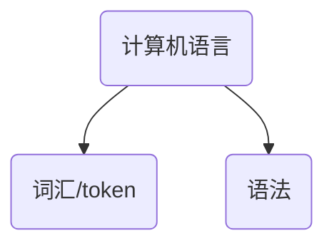
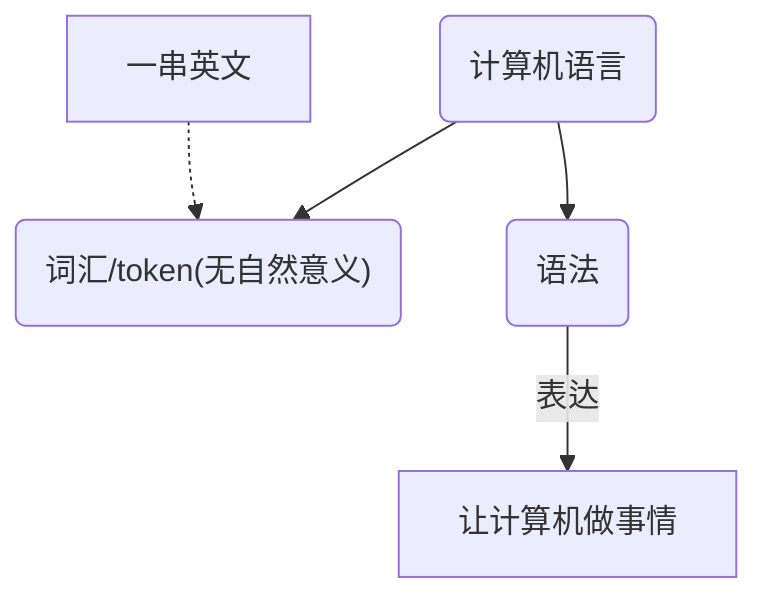
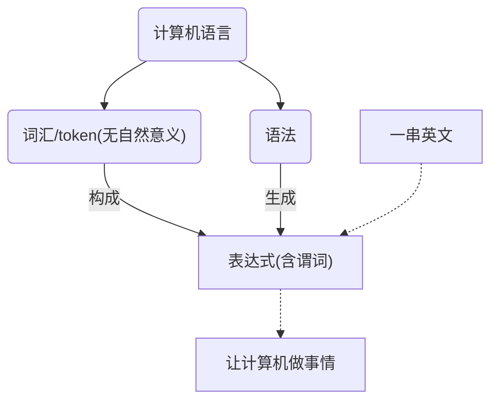
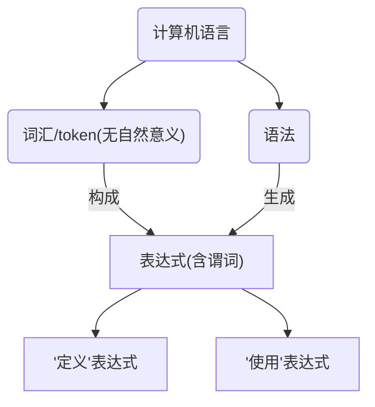
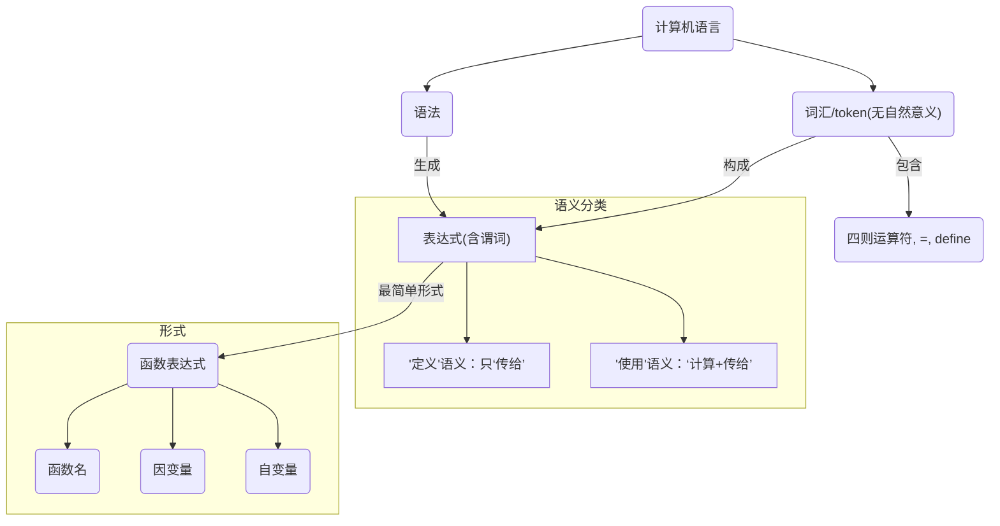

# 第一章
&nbsp;&nbsp;&nbsp;&nbsp;&nbsp;&nbsp;&nbsp;&nbsp; 今年开始，我正式步入高中生涯，新的环境新的面孔，不过枯燥的学习依旧不变。每天看着批站，总能刷出一些“学习python年薪百万”的广告，如今程序猿行业貌似非常火(nei)热(juan)。突然间，我萌生学习计算机编程的想法，一来我觉得高一的课程还算轻松，二来便是觉得高中生活无聊想找不自在。于是趁热打铁，到了午休，我去到图书馆想看找一下计算机类入门书籍。根据图书馆分类指示，我来到计算机分类下书架，发现入眼全是带Windows，Office之类字眼的书，翻开来大致看了看，基本说的使用指导，最后还发现了它们出版年份竟比我出生日期还要早！一时找不到合适的书籍，我便去图书馆里提供的电脑前，利用度娘的力量，看一下有没有推荐的书籍。当我输入“计算机语言”之后，度娘反馈的结果星罗棋布：“人生苦短，我学python”；“一个月学会java”；“吹爆C#.Net”；“快乐学习web/JavaScript”；“千万不能学C++”；“php是世界上最好的语言”。我横竖看不明白，仔细看了半天，才从字缝里看出字来，满本都写着两个字是“推销”！
&nbsp;&nbsp;&nbsp;&nbsp;&nbsp;&nbsp;&nbsp;&nbsp; 这时，从我身后忽然冒出一股轻灵的声音：“你想学编程？”我扭过头看向说话人——原来是个妹纸，啊是的，教练我想打篮球，呸，
&nbsp;&nbsp;&nbsp;&nbsp;&nbsp;&nbsp;&nbsp;&nbsp; “嗯，我想学编程，你会吗？”我指了指我搜索的内容，好奇地看着这位妹纸。妹纸似乎对她刚才“冒失”地发言有些后悔不知所措，我看出来之后，便想缓和气氛，说：“我还在找，要学什么计算机语言比较好，同学你有什么推荐吗？”妹纸听完看了我几眼，之后就说了句不好意思便跑开了，留下我在这喧嚣的空气中独自美丽~
&nbsp;&nbsp;&nbsp;&nbsp;&nbsp;&nbsp;&nbsp;&nbsp; 好在第二天有着计算机课。计算机课一个星期只有一节，而且到了高三就会被停掉，不过对于有着计算机竞赛的高三学生，学校就还可以另外给他们补开竞赛课程。学校的计算机教室建的比较大，所以一般都会安排同一年级两个班一起上课。今天计算机课教的是Office使用功能，听说学校的基础计算机课不会教编程，因为校方认为学习编程会增加学生的课程压力，对高考没有多大帮助，一般只给有竞赛的学生额外辅导。于是我趁着自由操作练习的时间，跑去和计算机老师说，我想学编程。“你也想学编程呀？”听到老师说了“也”字，我脑海里一下闪过昨天那妹纸的画面。然后老师叫我下课的时候去他的办公室找他。
&nbsp;&nbsp;&nbsp;&nbsp;&nbsp;&nbsp;&nbsp;&nbsp; 下课了，我根据老师给的指示，来到了他的办公室。这时候竟然发现了昨天的妹纸也在计算机老师的办公桌旁，似乎也在等计算机老师。果然，她“也想学编程”。那妹纸似乎也发现了我，于是向我挥了挥手。这时候，计算机老师却从我背后出现，快步越过了我。难道妹纸是想老师挥手？？不对吧，为了不失礼貌，我也向妹纸挥了挥手。计算机老师坐到了他办公椅上，然后拿了两张便签，写了一些东西，写完之后，对折了便签，一份交给了妹纸，另一份我了。“你们根据这些问题寻找答案，然后下个星期电脑课做成报告，向我汇报。”老师说完便让我们下去了。
&nbsp;&nbsp;&nbsp;&nbsp;&nbsp;&nbsp;&nbsp;&nbsp; 那妹纸打开便签看了一眼，便也出去了，我也跟着出去了。出了办公室，我才打开来看，里面写了只有一句话，“什么是计算机语言？”忽然，一阵略微熟悉的声音从背后响起，“要不要我们明天午休到图书馆交流一下答案？”我当然知道声音主人是谁，我对她点了点头，“OK，那明天我们讨论一下。”，然后我向她示意了我的便签，“我这里写的是‘什么是计算机语言’，你的呢？”妹纸看了我的便签笑了笑，“嘻嘻，明天再告诉你。”说完便又向我挥了挥手走了。
&nbsp;&nbsp;&nbsp;&nbsp;&nbsp;&nbsp;&nbsp;&nbsp; 翌日午休，我如约地来到了图书馆。找到了那位妹纸，发现她已经坐在图书馆提供的桌椅上，在拿着笔写着一些笔记。我顺势坐到了她隔壁。然后她便那着昨天老师给她的便签给了我看，我看了一眼发现她的问题似乎比我难得多——便签上面写着“计算机语言的**要素**是什么？”。 接着她问：“你对你的问题有什么想法吗？”
&nbsp;&nbsp;&nbsp;&nbsp;&nbsp;&nbsp;&nbsp;&nbsp;我回答说：“我昨晚在家用度娘翻查了一些，度娘说‘计算机语言是人与计算机之间传递信息的媒介’。接着计算机语言可以分成机器语言，汇编语言，高级语言，还有第四代语言。然后计算机语言有过程式编程，面向对象编程和函数式编程。总的来说，我觉得计算机语言就是一串英文，然后我们可以通过它来让计算机做事情。”
&nbsp;&nbsp;&nbsp;&nbsp;&nbsp;&nbsp;&nbsp;&nbsp;“嗯嗯，大致是这样”，然后她开始把我说的话写了下来，其实我觉得她对我的回答不太满意。她继续说道：“计算机语言和我们平时语言功能一样，只不过计算机语言是用来给人和计算机沟通用的。想想我们平时学习一门语言的时候，一般都要学什么？”
&nbsp;&nbsp;&nbsp;&nbsp;&nbsp;&nbsp;&nbsp;&nbsp;我回想学英语的情景，回答说：“要背单词和学语法。”。这次我看得出她给了个肯定的点头，“嗯，没错。计算机语言也是如此，它也有分成词汇和语法两部分。”

看着她在A4纸上描绘着，她开始了她的表演：“然后就是计算机语言特殊的部分，如果把我们平时用的语言称为‘自然语言’，那么计算机语言就被称作一种‘形式语言’。形式语言中的词汇是没有自然意义的，它的作用只有辅助语法的表达。”
&nbsp;&nbsp;&nbsp;&nbsp;&nbsp;&nbsp;&nbsp;&nbsp;“‘没有自然意义’是什么意思？”我疑惑问。
&nbsp;&nbsp;&nbsp;&nbsp;&nbsp;&nbsp;&nbsp;&nbsp;“所谓的‘自然意义’，这是我刚刚凭空捏造的概念，”她似乎有些对这个新生概念有些满意，“是指词汇自身的表达意思，例如‘苹果’，‘apple’，它们都可以在自然界找到它们的意义。而计算机语言的词汇，我们称它为token，它对应自然界中没有意义，它只有在计算机语法里面才有意义。”
&nbsp;&nbsp;&nbsp;&nbsp;&nbsp;&nbsp;&nbsp;&nbsp;我似懂非懂点了点头，她继续说道：“语言是为了表达而存在，而计算机语言就重点关注如何表达这层面，也就是语法。那么表达的作用就是让计算机做事情。”

&nbsp;&nbsp;&nbsp;&nbsp;&nbsp;&nbsp;&nbsp;&nbsp;看着她把我说的话和她的“理论”结合起来，我似乎有些惊喜。“那么，”她继续说，“其实所有计算机语言都有共通的语法，也就是说它们的表达其实大同小异。”
&nbsp;&nbsp;&nbsp;&nbsp;&nbsp;&nbsp;&nbsp;&nbsp;“我们现在开始关注表达。刚刚我说了*计算机语言表达的作用是让计算机做事情*，所以我们用于表达的‘句子’一定要有谓词，例如‘我看书’，‘我写字’等等；而那些‘今天天气晴朗’，‘我很开心’，‘我在思考’等不带谓词的句子在计算机语言的语法看来是不完整的，它没有让计算机做任何事情。那我们把这种带谓词完整句子，称作‘表达式’。你说的‘一串英文’实际上是一串‘表达式’。”

&nbsp;&nbsp;&nbsp;&nbsp;&nbsp;&nbsp;&nbsp;&nbsp;妹纸稍微修正了她的图，继续说，“那么计算机编程实际上就是在编写表达式。”妹纸继续在纸上画图，“而在我看来，表达式大致分成两种：‘定义’的表达式和‘使用’的表达式。”

&nbsp;&nbsp;&nbsp;&nbsp;&nbsp;&nbsp;&nbsp;&nbsp;“或着说，含谓词的句子划分成‘be-something’和‘do-something’两中截然不同的语义。”她说完，我联系了英语语法学习的时候，似乎也有相同的感觉——“be-something”是什么和“do-something”做什么表达的东西不一样：一个东西当它说完它“是什么”的时候，我们就知道它可以“做什么”；相反，我们也可以根据一个东西可以“做什么”去推断它可能“是什么”。
&nbsp;&nbsp;&nbsp;&nbsp;&nbsp;&nbsp;&nbsp;&nbsp;“我们继续关注表达式吧。我们应该都很熟悉一种非常简单常用的表达式”她说着说着看向了我，我也看着她，她在期待我回答，到底是什么常用表达式呀？我抓了抓头，突然灵光一闪，“哦哦，数学表达式。”
&nbsp;&nbsp;&nbsp;&nbsp;&nbsp;&nbsp;&nbsp;&nbsp;这次她满意的点了点头，“嗯，数学表达式不仅是我们常用的表达式，在计算机语言里面也是如此。”她在A4纸上写下了那个著名而且耳熟能详的数学表达式——“1+1=2”。“那么我们分析一下这个表达式的结构：如果我们把加号看成一个函数a的话，那么这两个1属于是自变量，2属于因变量，我们写成函数的形式吧。”
$$
\vdash y= a(x_1, x_2) = x_1+x_2
$$$$
\vdash 2 = a(1, 1) = +\ 1\ 1
$$
&nbsp;&nbsp;&nbsp;&nbsp;&nbsp;&nbsp;&nbsp;&nbsp;“我们不妨把加号提到两个的前面，这样和函数的形式可以统一。”她说。我看着这种新式写法有些不习惯，“可以是可以，但是没有必要吧。”
&nbsp;&nbsp;&nbsp;&nbsp;&nbsp;&nbsp;&nbsp;&nbsp;她听完我的话，顿了一下，说：“嗯，那我们现在写下1+1+1+1=4这个表达式。我们会发现这里同一个加号出现了三次，它们表达意思都是一样的，那我们是不是可以通过‘合并同类项’的方式，这样可以减少重复。”
$$
\vdash 2 = 1+1+1+1
$$$$
\vdash 2 = +(1\ 1\ 1\ 1)
$$
&nbsp;&nbsp;&nbsp;&nbsp;&nbsp;&nbsp;&nbsp;&nbsp;看完她的表演，我心中哦吼一下，下意识说：“哦吼，还有这种骚操作？”她似乎感到一丝愉悦，继续说：“我们把加号提前还有一种好处，我们观察这两个表达式：”
$$
1 +  2 \times 3
$$$$
1 \times (2 + 3)
$$
&nbsp;&nbsp;&nbsp;&nbsp;&nbsp;&nbsp;&nbsp;&nbsp;“如果我们使用运算符提前的写法，那我们就可以减少括号的使用，只要遵循从里到外运算顺序即可。”
$$
1 +  2 \times 3 \vdash +\ 1\ \times \ 2\ \ 3
$$$$
1 \times (2 + 3) \vdash \times\ 1\ +\ 2\ \ 3 
$$
&nbsp;&nbsp;&nbsp;&nbsp;&nbsp;&nbsp;&nbsp;&nbsp;渐渐我对她的骚操作感觉是越来越迷。不过仔细想想确实无不道理，然后我也拿我的笔在A4纸写下了一个复杂的表达式：
$$
(1 +1) \div ((2 + 3) \div (9 - 6 \times 2)) \vdash \div +1\ 1\ \div +2\ \ 3\ - 9\times 6 \ \ 2
$$
&nbsp;&nbsp;&nbsp;&nbsp;&nbsp;&nbsp;&nbsp;&nbsp;哦吼，确实不用括号也能正确执行运算顺序。她看完我写的表达式后，说：“不错不错，这么快可以举一反一。”听完她的夸奖，我心里有些开心。不过这种运算符前置的写法需要一些技巧。 不过这到底有什么用？哦哦，和函数表达形式统一，差点忘了。然后我又写下了另一个表达式：
$$
(1+2+3+4) + 5 \vdash + (1+2+3+4)\ \ 5  \vdash +\ +\ 1\ 2\ 3\ 4\ 5
$$
&nbsp;&nbsp;&nbsp;&nbsp;&nbsp;&nbsp;&nbsp;&nbsp;诶？似乎这个转换变得奇怪了。因为从转换结果逆推，有多个初始状态：
$$
    + +1\ 2\ 3\ 4\ 5 \Rightarrow (1+2)+3+4+5
$$$$
    + +1\ 2\ 3\ 4\ 5 \Rightarrow (1+2+3)+4+5
$$
&nbsp;&nbsp;&nbsp;&nbsp;&nbsp;&nbsp;&nbsp;&nbsp;我皱起了眉头，望向妹纸，疑惑这种“错误”是为什么产生。妹纸看了我写的表达式，沉思了一下说：“嗯，虽然我说过，多个相同的加号可以把加号提出来，但是提出来之后的加号就和原来的加号的意思不一样了。”我挠了挠头，加号，不都是加号吗？哪里不一样？
&nbsp;&nbsp;&nbsp;&nbsp;&nbsp;&nbsp;&nbsp;&nbsp;妹纸继续说：“原来的加号，如果看作一个函数，那么它的自变量只有两个。而合并出来的加号，自变量却是四个。”妹纸说完，便重写了我的式子：
$$
(1+2+3+4) + 5 \vdash +_2 (1+2+3+4)\ \ 5  \vdash +_2\ +_4\ 1\ 2\ 3\ 4\ 5
$$
&nbsp;&nbsp;&nbsp;&nbsp;&nbsp;&nbsp;&nbsp;&nbsp;“我们可以通过加下标的方式，区别加号的自变量个数，这样就不会出错了。”我看了看这个新式子：我们可以通过下标知道，这一个加号后面要读取多少个数字，果然不会出现我刚才那种错误。所以，相同的加号但不同自变量个数是相当于两个不同的加号。
&nbsp;&nbsp;&nbsp;&nbsp;&nbsp;&nbsp;&nbsp;&nbsp;“那么总结一下，一个函数表达式由函数名、自变量、因变量三部分组成。即便函数名一样，也可以根据自变量的不同而区分不同函数。”妹纸做了一个总结。我点了点头，忽然我若有所思，接着问了一句：“那么可以根据因变量来区分函数吗？”
&nbsp;&nbsp;&nbsp;&nbsp;&nbsp;&nbsp;&nbsp;&nbsp;妹纸这次沉思了许久，说：“这个问题值得考究，今天先放下吧。”然后她又接回她的话题，“我们刚才说了，表达式分成‘定义’的表达式和‘使用’的表达式，这算是从语义上区分。而在形式上，我们有熟悉的数学表达式和函数表达式。但是函数表达式并不能表达这个式子到底是定义或者使用，”
&nbsp;&nbsp;&nbsp;&nbsp;&nbsp;&nbsp;&nbsp;&nbsp;我还没等妹纸说完，我抢答道：“我们可以用函数表达式在等号左边或者是右边来区分定义和使用。”
$$
定义：f(x,y) = +\ x \times y\ \ 2
$$$$
使用：5 = f(1, 2)
$$
&nbsp;&nbsp;&nbsp;&nbsp;&nbsp;&nbsp;&nbsp;&nbsp;“如果函数表达式在等号左边，我们就可以认为这是个‘定义’的表达式，如果函数表达式在等号右边，我们就可以认为这是个‘使用’的表达式。”妹纸看了看我写的表达式，似乎她没有因为我抢答而不悦，反而陷入一段思考，认真说：“如果用等号来去别的话，那么这句表达式就有问题：”
$$
g(x,y) = \times\ 2\ \ f(x,y)
$$
&nbsp;&nbsp;&nbsp;&nbsp;&nbsp;&nbsp;&nbsp;&nbsp;“这个表达式到底是定义还是使用呢？”妹纸开始笑嘻嘻地看着我。我开始后悔我的抢答了。妹纸看到我奇妙地表情后，继续说“其实我也有想过用等号来区分，不过总觉得用等号来区分的话，等号的表达能力就太广了，容易产生歧义。我们这里引入‘define’这个token，来区分‘定义’和‘使用’吧。”
$$
define\  f(x,y) = +\ x \times y\ \ 2
$$$$
define\  g(x,y) = \times\ 2\ \ f(x,y)
$$$$
10 = g(1, 2)
$$
&nbsp;&nbsp;&nbsp;&nbsp;&nbsp;&nbsp;&nbsp;&nbsp;“这里等号有两个作用，第一个是计算右边的数值，第二个就是把右边的结果传给左边。而如果带有define这个token的话，等号只有第二个作用。”
&nbsp;&nbsp;&nbsp;&nbsp;&nbsp;&nbsp;&nbsp;&nbsp;“计算，传给，嗯”我听完之后一直呢喃这两个词，然后我又灵光一闪，写下又一个表达式：
$$
define\ h(z) = z \times g(1,2)
$$
&nbsp;&nbsp;&nbsp;&nbsp;&nbsp;&nbsp;&nbsp;&nbsp;“那这个等号要不要计算？”我问道。妹纸看完我写的式子，又笑了，不过这次的笑有些赞许的意思，“你的思考挺棒的。这么快就想到点子上。我刚刚说，带define的表达式下等号只做‘传给’功能，**所以这个函数g的计算，我们可以等到使用函数h的时候再计算。当然我们也是在define的时候就把函数g给计算出来。** 这两种处理都是可以的，具体是如何对等号语义进行解释。”
&nbsp;&nbsp;&nbsp;&nbsp;&nbsp;&nbsp;&nbsp;&nbsp;妹纸在等我理清思路的时候，重新描绘她的结构图：

忽然，午休铃声结束，开始要准备上下午的课了。妹纸连忙收拾了手边的纸笔，然后和我说了句，“我们下午放学再继续讨论吧。拜拜~”我还没反应过来，就下意识向她挥了挥手示意再见。哎，我还没有问她的名字呢，忽然我的歪点子上头了，不如叫她Ada吧。
> 本作品优先采用<a rel="license" href="http://creativecommons.org/licenses/by-nc-sa/4.0/">CC BY-NC-SA 4.0</a>进行许可。
